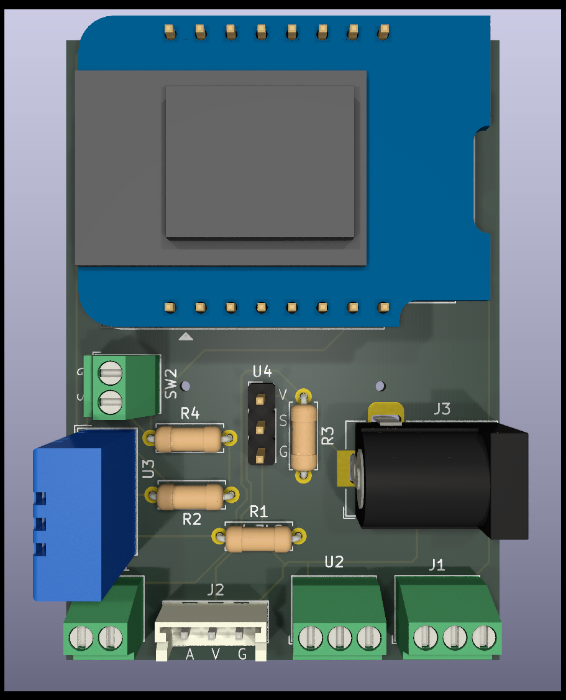
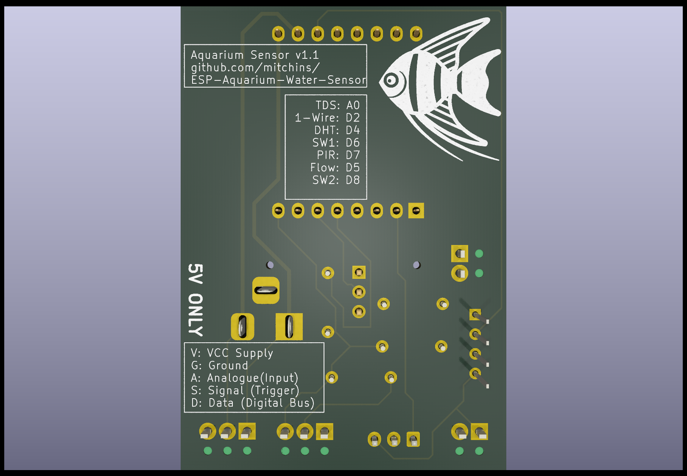

# ESP-Aquarium-Water-Sensor

A simple water flow and quality sensor for aquariums based on ESP controller. 
This board helps measure the quality of the water and its parameteres in real-time, such that alerts and graphs can be setup.

The device is conveniently be powered off usb and provides a wifi connection for ease of connection.
The core of this device is the ubiquitous Wemos D1 Mini, which is easily available and low cost.
It has a modular list of external sensors, however if for whatever reason your application does not require it, they can be omitted.

## Features

* Measure the water flow rate (via YF-S201)
* Measure total dissolved solids (TDS) for water quality (via KS0429)
* Measure the internal water temperature (via DS18B20 probe)
* Respond to switch inputs (reed, contact or button) with 10K pull-up.
* Monitor board/enclosure/cabinet temperature and humidity (onboard DHT-11)

## Peripheral Connections

| **Component**         | **Pin**     | **Connection**    |
|-----------------------|-------------|-------------------|
| **TDS Sensor (KS0429)** | A0          | Analog output      |
| **1-Wire Sensor (DS18B20)** | D2          | 1-Wire digital protocol |
| **DHT Sensor (DHT11/DHT22)** | D4          | Digital signal     |
| **Reed Switch 1**      | D6          | Digital input      |
| **PIR Motion Sensor**  | D7          | Digital input      |
| **Water Flow Sensor (YF-S201)** | D5          | Pulse counting     |
| **Reed Switch 2**      | D8          | Digital input      |

## Software

The primary software consideration for this use case is ESPHome.
All of the functions provided are common and turnkey and thus no code is required to be written or debugged.

### ESPHome

The best way to use ESPhome is through Home Assistant, if you have that then goto the add-ons section and install it.
You can still use ESPHome manually without Home Assistant by following the latest guide [here](https://esphome.io/guides/installing_esphome.html)
### Example ESPHome Configuration:
#### Please note, this configuration is currently untested until the PCB arrives.

```YAML
esphome:
  name: aquarium_monitor
  platform: ESP8266
  board: d1_mini

wifi:
  ssid: "your_wifi_ssid"
  password: "your_wifi_password"

  # Enable fallback hotspot (captive portal) in case wifi connection fails
  ap:
    ssid: "Aquarium Monitor Fallback"
    password: "fallback_password"

captive_portal:

# Enable logging
logger:

# Enable Home Assistant API
api:
  password: "your_api_password"

# Enable over-the-air updates
ota:
  password: "your_ota_password"

# TDS Sensor (Analog Sensor)
sensor:
  - platform: adc
    pin: A0
    name: "TDS Sensor"
    update_interval: 60s

# DS18B20 Temperature Sensor (1-Wire)
dallas:
  - pin: D2

sensor:
  - platform: dallas
    address: 0xADDRESS  # Replace with actual address
    name: "Water Temperature"
    update_interval: 60s

# DHT11 Sensor (Temperature and Humidity)
dht:
  model: DHT11  # Or use DHT22 if applicable
  pin: D4
  temperature:
    name: "Air Temperature"
  humidity:
    name: "Air Humidity"
  update_interval: 60s

# YF-S201 Water Flow Sensor (Pulse Counter)
sensor:
  - platform: pulse_counter
    pin: D5
    name: "Water Flow Rate"
    unit_of_measurement: "L/min"
    update_interval: 60s

# PIR Motion Sensor (AM312 or HC-SR505)
binary_sensor:
  - platform: gpio
    pin: D7
    name: "Motion Detected"
    device_class: motion

# Reed Switch 1
binary_sensor:
  - platform: gpio
    pin: D6
    name: "Reed Switch 1"
    device_class: opening

# Reed Switch 2
binary_sensor:
  - platform: gpio
    pin: D8
    name: "Reed Switch 2"
    device_class: opening

# Optional: Status LED for debugging
status_led:
  pin:
    number: D0
    inverted: true

```

## Board Renderings

#### Front



#### Back


